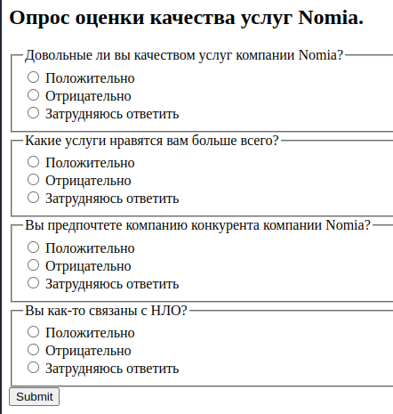
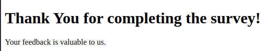
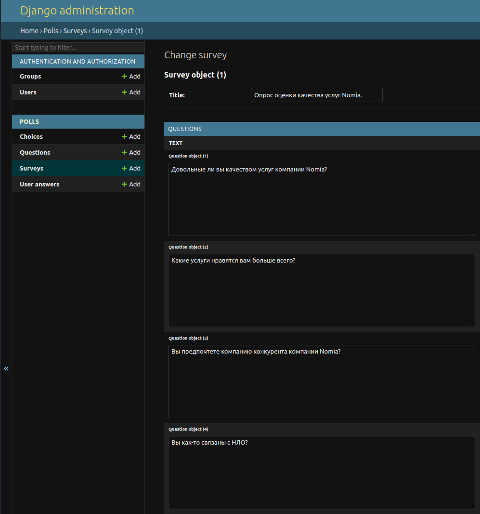
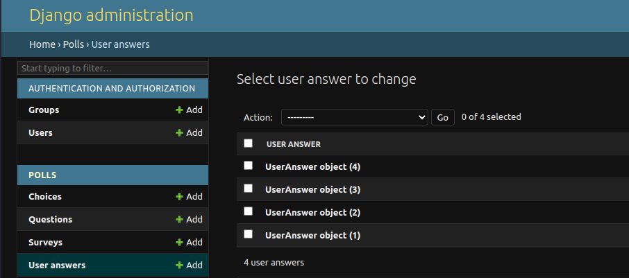

# Тестовое задание

### Cоздание сервиса опросов с учетом пользователя и динамическим отображением вопросов.

> **Создайте веб-приложение на базе Django для проведения опросов и возможностью динамического отображения вопросов в зависимости от ответов пользователя.**
> 

Приложение должно включать в себя модели для опросов, вопросов и ответов, а также следующие функции: 

- Создание и редактирование опросов и вопросов через админку.
- Реализацию веб-интерфейса, позволяющего пользователям проходить опросы и отвечать на вопросы.
- Сохранение ответов пользователей в связке с соответствующими опросами.
- Логику, позволяющую определить, какие вопросы показывать или скрывать в зависимости от предыдущих ответов пользователя (т.е. дерево)
- Вывод результатов опросов, включая статистику ответов на каждый вопрос, после завершения опроса.
    
    Реализовать с помощью минимального кол-ва SQL-запросов *без использования ORM*:
    
    - Общее кол-во участников опроса (например, 100)
    - На каждый вопрос:
        - Кол-во ответивших и их доля от общего кол-ва участников опроса (например, 95 / 95%)
        - Порядковый номер вопроса по кол-ву ответивших. Если кол-во совпадает, то и номер должен совпадать (например, для трех вопросов с 95, 95, 75 ответивших получаются соответствующие им номера 1, 1, 2)
        - Кол-во ответивших на каждый из вариантов ответа и их доля от общего кол-ва ответивших на этот вопрос после завершения опроса.

Результат:

